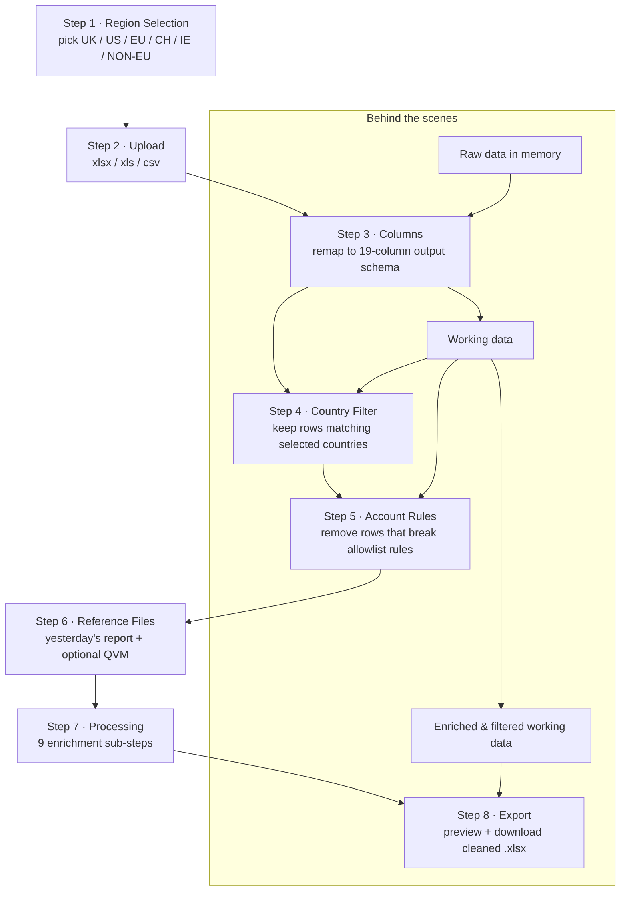

# Workflow — The 8 Steps

This document walks through the whole user journey of the app, step by step, with a diagram of how data moves through the tool. It is written for both business and technical readers.

Related docs: [README.md](README.md) (landing) · [business-rules.md](business-rules.md) (the rules behind the steps) · [processing-pipeline.md](processing-pipeline.md) (what "Run Processing" does in detail).

---

## The flow at a glance

**What goes in:** one raw Excel/CSV report, and optionally a "yesterday/morning" report and a QVM file.

**What comes out:** a cleaned `.xlsx` with a standardised column order, backfilled tracking numbers, colour-coded rows, and only the rows that passed every filter.

---

## Step 1 — Region Selection

- Six region cards are shown: **UK, US, EU, CH, IE, NON-EU**.
- **Click once** to select a region, **click again** to deselect.
- Multiple cards can be selected to build a **custom combination** (e.g. UK + IE, US + UK + NON-EU).
- **Quick Combinations** buttons:
  - **Select ALL (Global)** — selects all 6 regions.
  - **UK + IE** — selects those two.
  - **US + UK + NON-EU** — selects those three.
  - **Clear** — deselects everything.
- A summary pill shows the current selection (e.g. `ALL`, `UK+IE`, `US+UK+NON-EU`).
- **NON-EU** is a catch-all that *excludes* UK, US, CH, IE — those countries have their own dedicated cards.
- The **Continue to Upload** button stays disabled until at least one region is selected.

## Step 2 — Upload

- Drag & drop a file, or click to browse (`.xlsx`, `.xls`, or `.csv`).
- On success, the app shows a file-info card with:
  - File name
  - Row count & file size
  - Active sheet name
- The raw data is stored as the **original** dataset; a **separate copy** becomes the "working" dataset that all later steps edit.
- **Continue to Columns** becomes available. **Back** returns to Region Selection.

## Step 3 — Column Cleanup

- Columns are remapped to the required **output schema** (19 columns, defined in `app.js:9`).
- **EXP DATE** is added as a brand-new empty column — it is later filled from yesterday's report.
- Matching is case-insensitive and whitespace-tolerant: any raw column whose *name* matches an output column is copied across (see [data-model.md](data-model.md) for the normalisation rules).
- Output column order:
  1. Trial AWB
  2. Description
  3. UPS Tracking
  4. MAWB
  5. Ch To key
  6. Group A c Name
  7. Sched Collection date
  8. Collection Date
  9. Sched Delivery date
  10. Charge Reference
  11. Collection Country
  12. Delivery Country
  13. Collection Town
  14. Delivery Town
  15. EXP DATE *(new)*
  16. Latest Dry Ice Replenishment
  17. Contents Description
  18. Temperature
  19. Packaging Type Size
- Click **Apply & Continue** to perform the remap. (Note: `EXP DATE` rows are untouched by later *column* logic, but filled during Processing.)

## Step 4 — Country Filter

- Shows a grid of countries for the selected region combination.
- Use **Select All** / **Deselect All** or click individual countries; the counter shows how many are selected.
- **Filtering rule:** a row is kept only if its **Delivery Country** matches a selected country.
- **Special case:** if all 6 regions are selected ("Global"), every row passes — 0 rows are removed.
- **NON-EU logic:** when NON-EU is selected, a country matches if it is *not* an EU member and *not* one of the dedicated-region countries (UK, US, CH, IE).
- Click **Apply Filter** → the number of removed rows is reported in a toast and the sidebar "Removed" stat updates.

## Step 5 — Account Rules

- Default rules are pre-loaded (see [business-rules.md](business-rules.md) for the exact list).
- Each rule means: *"if a row's Ch To key matches the rule, but the row's town is not on the rule's allowlist, remove the row."*
- Each rule checks either **Delivery Town only** or **Collection Town *or* Delivery Town** (the "both directions" toggle).
- Rules can be deleted, or new ones added via the form (keys and towns are comma-separated).
- Click **Apply Rules** → the count of removed rows is reported.

## Step 6 — Reference Files

Two reference uploads:

- **Yesterday's Report / Morning Report** *(required)* — used to enrich Description, UPS Tracking, EXP DATE, and row colours.
- **QVM File** *(optional)* — used to backfill missing UPS Tracking / MAWB numbers.

- Files are read as arrays (`AoA`) and a **lookup Map is keyed on the Trial AWB** in column A.
- The **Run Processing** button only unlocks once yesterday's report is loaded.
- Clicking **Continue to Processing** resets the processing state, clears any previous row colours and log, and moves to Step 7.

## Step 7 — Processing

Click **Run Processing** to run **9 sub-steps** in sequence. Each sub-step writes a live entry into the processing log and removes/filters/colours rows as it goes. The full detail is in [processing-pipeline.md](processing-pipeline.md).

1. **Description Enrichment** — refresh from yesterday's report; convert "Courier Service" to N/A.
2. **UPS Tracking** — refresh tracking numbers.
3. **1Z Consolidation** — consolidate multiple 1Z tracking numbers into a single `UPS Tracking/MAWB` column.
4. **QVM Backfill** — fill empty tracking cells from QVM (skipped if no QVM uploaded).
5. **MAWB Backfill** — fill remaining empties from the MAWB column, then remove the MAWB column.
6. **EXP DATE Lookup** — populate expiry dates from yesterday's report.
7. **Packaging Comments** — insert a comment column and colour rows from the yesterday column.
8. **Charge Reference Colours** — colour remaining uncoloured rows orange by Charge Reference (LT19062 / LT18925 / EP5770).
9. **Collection Date Cleanup** — delete rows with a blank or future Collection Date (only past dates and today are kept).

When finished, the summary shows final row count and how many rows were coloured, and **Continue to Export** appears.

### Row colour key

| Colour | Letter in comment column | Hex |
|--------|--------------------------|-----|
| 🟡 Yellow | Y | `#FFE600` |
| 🟣 Purple | P | `#BD77F2` |
| 🔴 Red | R | `#FC2700` |
| 🟠 Orange (charge ref) | O | `#FFB105` |
| 🔵 Blue | B | `#05CDFF` |

## Step 8 — Review & Export

- **Summary cards** show: original rows, region-removed rows, rule-removed rows, rows coloured, final rows.
- A **preview table** shows the first 10 rows with full cell borders and colour coding.
- **Empty UPS Tracking/MAWB cells** are displayed as **N/A**.
- Click **Download Cleaned Report (.xlsx)** to export a workbook with:
  - Frozen header row
  - Bold header on dark fill
  - Left-aligned cells
  - Colour-coded rows
  - Auto-filter on every column
  - File named `EDI outstanding POD report <DD.MM.YYYY> <region>.xlsx`
- **Start Over** resets the entire workflow for a new file/region (reverts to the default rules, clears reference files, returns to Step 1).

---

## UI features worth knowing

- 8-step sidebar rail shows live row stats — **Working rows** and **Removed rows** count up as you progress.
- **Dark mode** toggle in the top bar, persisted in `localStorage` (`brand-theme`).
- Toast notifications confirm each action or show errors.